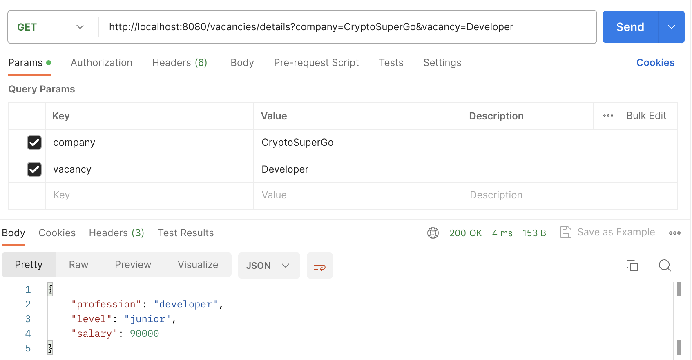

# Job-Center
Client-Server application in Kotlin using Ktor, Dagger2 and Retrofit2

## Введение

Этот проект представляет собой клиент-серверное приложение, где сервер реализован на Ktor, а клиент - на Android с использованием Dagger2 и Retrofit2. Ktor используется для создания сервера, который обрабатывает HTTP-запросы, а Dagger2 и Retrofit2 используются на клиенте для управления зависимостями и выполнения сетевых запросов соответственно.
### Получение списка компаний by Postman

### Получение информации о компании by Postman

### Получение списка вакансий by Postman

### Получение информации о вакансии by Postman

### В приложении

  
  
  
  

## Требования

- Android Studio  4.0 или выше.
- JDK  8 или выше.
- Android устройство или эмулятор для запуска клиентского приложения.

## Установка и запуск

### Сервер (Ktor)

1. Откройте проект сервера в вашей IDE (например, IntelliJ IDEA).
2. Запустите сервер, используя команду: *./gradlew run* или через конфигурацию запуска в вашей IDE.
3. Сервер будет запущен и будет слушать входящие подключения на порту, указанном в конфигурации.

### Клиент (Android)

1. Откройте проект клиента в Android Studio.
2. Убедитесь, что у вас настроен эмулятор или подключено реальное устройство.
3. Запустите приложение, нажав на кнопку "Run" в Android Studio.

## Функциональность

- **Сервер**: Обрабатывает HTTP-запросы от клиента.
- **Клиент**: Использует Retrofit2 для выполнения сетевых запросов к серверу и Dagger2 для управления зависимостями.

## Пример использования

1. Запустите сервер.
2. Запустите клиентское приложение на Android устройстве или эмуляторе.
3. Осуществляйте навигацию по списку доступных компаний/вакансий.
4. Enjoy!

## Заключение

Этот проект демонстрирует использование Ktor для создания сервера и Dagger2 и Retrofit2 для управления зависимостями и выполнения сетевых запросов в Android клиенте. Это позволяет создавать мощные и масштабируемые приложения на Kotlin.

## Лицензия

Этот проект распространяется под лицензией [MIT](LICENSE).

## Контакты

- **Email**: alexey.logo@gmail.com
- **GitHub**: [Samiaza](https://github.com/Samiaza)
